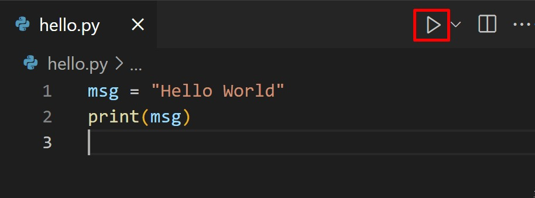

# Questions Python

- **Quelle est la différence entre une liste et un tuple ?**

Une liste est une collection ordonnée et modifiable (mutable) d’éléments de tout type. Elle est délimitée par des crochets ``[]``.

***Exemple : ma_liste = ['orange', 2, 'banana', 30.1 , 'kiwi']***

Un tuple est une collection ordonnée mais non modifiable (immutable). Il est délimité par des parenthèses ``()``.

***Exemple : mon_tuple = ('orange', 2, 'banana', 30.1 , 'kiwi')***

Les principales différences sont que les tuples ont une taille fixe, contrairement aux listes, que les tuples sont immutables, c'est à dire qu'ils ne sont pas modifiables, et que les tuples sont légèrement plus rapides que les listes.

---

- **Comment fonctionne ``*args`` et ``**kwargs`` dans une fonction ?**

Les paramètres ``*args`` et ``**kwargs`` agissent comme des arguments fourre-tout et indéfinis. Ils permettent de passer un nombre variable d’arguments à une fonction.

***Note : le ``*`` s'appelle opérateur splat.***

Le paramètre ``*args`` (dont le nom est une convention) est utilisé pour collecter plusieurs arguments non nommés et retourne un tuple. On peut les parcourir comme une liste. ``for arg in args:``

``` python

Exemple :

def foo(*args):
    print(args)

foo()                            # ()
foo(1)                           # (1,)
foo(1, 'Bonjour', True)          # (1, 'Bonjour', True)
```

Le paramètre ``**kwargs`` (dont le nom est une convention) est utilisé pour collecter plusieurs arguments nommés (clé = valeur | 'kw' = key word) et retourne un dictionnaire. On peut les parcourir comme un dict. ``for key, value in kwargs.items():``

``` python

Exemple :

def foo(**kwargs):
    print(kwargs)

foo()                                      # {}
foo(a=1)                                   # {'a': 1}
foo(a=1, mot='Bonjour', boolean=True)      # {'a': 1, 'mot': 'Bonjour', 'boolean': True}
```

Les ``*args`` et ``**kwargs`` peuvent être combinés, mais il faut respecter un ordre :

``` python
def ma_fonction(arg1, *args, **kwargs):
    pass
```

---

- Quelle est la différence entre ``is`` et ``==`` ?

L'opérateur ``==`` signifie "est égal à" et compare des valeurs (le contenu de 2 objets), tandis que l'opération ``is`` compare l'identité des objets.

``` python
x = [1, 2, 3]
y = [1, 2, 3]

print(x is y)  # False car x ne se réfère par à y. Les 2 ne pointent pas vers le même objet.
print(x == y)  # True car le contenu de x est égal au contenu de y.

z = x
print(x is z) # True car on est face au même objet.
```

---

- **À quoi sert ``elif`` au lieu de plusieurs ``if`` ?**

``elif`` (contraction de ``else if``) permet d'enchaîner plusieurs conditions exclusives après un ``if``.

Il est utilisé pour éviter de tester inutilement d'autres conditions une fois qu'une a été validée.

``` python
x = 10
if x == 5:
    print("Cinq")     # est testé
elif x == 10:
    print("Dix")      # est exécuté
elif x == 15:
    print("Quinze")   # n'est pas testé

```

---

- **Que fait la méthode ``split()`` sur une chaîne de caractères ?**

La méthode ``split()`` coupe la chaine de caractères (par défaut au niveau des espaces) et retourne une liste.

Si le séparateur ou aucun séparateur est trouvé, ``.split()`` retourne la chaîne de caractères entière dans une liste.

``` python
chaine = "Ma chaine de caractères"
chaine_splitee = chaine.split()
print(chaine_splitee)  # ['Ma', 'chaine', 'de', 'caractères']

date = "2025-06-23"
print(date.split("-")) # ['2025', '06', '23']

salutation = "Bonjour tout le monde"
print(salutation.split(",")) # ['Bonjour tout le monde']

```

---

- **Comment inverser une chaine de caractères en Python ?**

``` python
chaine = "Ma chaine de caractères"[::-1]
print(chaine) # sérétcarac ed eniahc aM

```

---

- **Comment inverser une liste en Python ?**

``` python
# Avec [::-1]
liste = [1, 2, 3, 4, 5]
liste_inversee = liste[::-1]

print(liste_inversee) # [5, 4, 3, 2, 1]

# Avec la méthode reverse()
liste.reverse()
print(liste) # [5, 4, 3, 2, 1]

```

---

- **Quelle est la différence entre une boucle ``for`` et une boucle ``while`` ?**

La boucle ``for`` sert à parcourir une séquence (liste, chaîne, range, etc.) quand on connaît le nombre d’éléments à traiter, tandis que la boucle ``while`` répète un bloc de code tant qu'une condition est vraie. (Utile lorsqu'on ne sait pas à l’avance combien de fois il faut itérer.)

``` python

# Boucle for
liste = [1, 2, 3, 4, 5]

for x in liste:
    if x <= 3:
        print(x) # 1, 2, 3

# Boucle while
x = 0
while x <= 3:
    print(x) # 0, 1, 2, 3
    x += 1

```

---

- **Comment sortir d'une boucle prématurément ?**

L'opérateur ``break`` permet de sortir d'une boucle prématurément.

``` python

nb = 0

for nb in range(10):
    if nb == 5:
       break

    print('Number is ' + str(nb))

print('Out of loop')

# Number is 0
# Number is 1
# Number is 2
# Number is 3
# Number is 4
# Out of loop

```

A noter que ``continue`` permet de sauter le reste du code dans la boucle et de passer à l’itération suivante.

``` python

nb = 0

for nb in range(5):
    if nb == 2: # ici nb = 2 sera ignoré
       continue

    print('Number is ' + str(nb))


# Number is 0
# Number is 1
# Number is 3
# Number is 4

```

---

- **Quelle est la différence entre ``map()`` et une boucle ``for`` ?**

La fonction ``map()`` permet d'appliquer une fonction à chaque élément d'un ou plusieurs itérables. Elle retourne un objet ``map`` (qu’on convertit souvent en ``list()``). Elle est idéale pour les opérations simples et directes.

``` python

def multiplie(nb1, nb2):
    return nb1 * nb2

liste = [1, 2, 3, 4, 5]
liste2 = [10, 20, 30, 40, 50]
resultat = list(map(multiplie, liste, liste2))

print(resultat) # [10, 40, 90, 160, 250]

```

La boucle ``for`` est plus flexible (possibilité de faire des conditions, des filtres, plusieurs actions). Elle nécessite d’initialiser une nouvelle liste si on veut stocker un résultat. Elle est plus lisible pour les traitements complexes.

``` python

def multiplie(nb1, nb2):
    return nb1 * nb2

liste = [1, 2, 3, 4, 5]
liste2 = [10, 20, 30, 40, 50]
resultat = []

for nb1, nb2 in zip(liste, liste2):
    resultat.append(multiplie(nb1, nb2))

print(resultat)  # [10, 40, 90, 160, 250]

```

---

- **Qu'est-ce que ``zip()`` ?**
  
``zip()`` est une fonction intégrée qui permet de regrouper plusieurs listes ou itérables élément par élément. Elle associe les éléments en paires (ou tuples), selon leur position.

``` python

prenoms = ["Alice", "Bob", "Charlie"]
ages = [25, 30, 22]

for nom, age in zip(prenoms, ages):
    print(nom, "a", age, "ans")

```

---

- **Comment trier une liste ? Quelle est la différence entre ``sort()`` et ``sorted()`` ?**
  
``sort()`` permet de trier une liste (et uniquement une liste) de manière alphabétique. Elle ne retourne pas de nouvelle liste (retourne ``None``) et modifie la liste initiale.

``` python

prenoms = ["Enzo", "Alice", "Charlie", "Bob"]
prenoms.sort()
print(prenoms) # ["Alice", "Bob", "Charlie", "Enzo"]

```

``sorted()`` permet de trier un tuple ou une liste de manière alphabétique tout en retournant une nouvelle liste triées. Elle ne modifie pas la liste ou le tuple original.

``` python

prenoms = ["Enzo", "Alice", "Charlie", "Bob"]
prenoms_tries = sorted(prenoms)
print(prenoms_tries)  # ['Alice', 'Bob', 'Charlie', 'Enzo']
print(prenoms)        # ['Enzo', 'Alice', 'Charlie', 'Bob'] — inchangé

```

---

- **Comment supprimer les doublons d’une liste tout en conservant l’ordre ?**

Les dictionnaires conservent l’ordre d’insertion. Avec ``dict.fromkeys(ma_liste)``, on crée un dictionnaire où les clés sont les éléments de la liste ```ma_liste```. Comme les clés d’un dict sont uniques, les doublons sont automatiquement éliminés. Transformer ce dictionnaire en liste avec ``list()`` donne la liste des clés dans l’ordre d’apparition.

``` python

names = ["James", "Bob", "James", "Mark", "Kate", "Sarah", "Kate"]
result = list(dict.fromkeys(names))
print(result) # ['James', 'Bob', 'Mark', 'Kate', 'Sarah']

```

---

- **Quelle est la différence entre une liste (``list``), un dictionnaire (``dict``), un ensemble (``set``) et une chaîne (``str``) ?**

Une liste ``list`` est une collection ordonnée et modifiable qui autorise les éléments en double.

Un dictionnaire ``dict`` est une collection ordonnée (à partir de python 3.7) de paires key-value (clé-valeur). Les clés sont uniques.

Un ensemble ``set`` est une collection non-ordonnée, non indexée et qui ne contient que des éléments uniques (pas de doublons).

Une chaîne ``str`` est une séquence immuable (qui ne change pas) de caractères qui peut être parcourue comme une liste. (Chaque élément est un caractère.)

``` python

list_ex = [1, 2, 2, 3] # doublon possible

dict_ex = {"nom": "Alice", "âge": 25} # key - value pair

set_ex = {1, 2, 3} # pas de doublon

str_ex = "Hello world"

```

---

- **Quelle est la différence entre une fonction et une méthode ?**

Une méthode est une fonction liée à un objet (comme une liste, une chaîne, etc.)  qui est appelée avec la syntaxe ``objet.methode()``, tandis qu'une fonction est un bloc de code réutilisable qui accepte des arguments. Cette dernière peut être appelée seule : ***Exemple : print(), len(), ou une fonction créée avec def.***

``` python

def func_example ():
    print("coucou")

func_example() # appel de la fonction

my_method_text = "example"
print(my_method_text.upper()) # appel de la méthode

```

---

- **Que signifie la portée d’une variable (``global`` vs ``local``) ?**

Une variable ``global`` est déclarée en dehors d'une fonction et est disponible dans toutes les fonctions et méthodes du fichier dans lequel elle a été déclarée. Elle ne peut être modifiée dans une fonction que si on utilise le mot-clé ``global``.

Une variable ``local`` est disponible, cloisonnée et exploitable uniquement dans la fonction dans laquelle elle a été déclarée. (Cela vaut pour les variables en tant que paramètre de la fonction et celles déclarées dans la fonction.)

``` python

compteur = 0  # variable globale

def incrementer():
    global compteur  # on indique qu'on veut modifier la variable globale grâce à "global"
    compteur += 1
    local_message = "Compteur incrémenté"  # variable locale
    print(local_message)

incrementer()
print("Valeur globale de compteur :", compteur)


x = "global"

def ma_fonction():
    x = "local"
    print("Dans la fonction :", x) # Dans la fonction : local

ma_fonction()
print("En dehors de la fonction :", x) # En dehors de la fonction : global

```

---

- **Qu'est-ce qu'une fonction lambda ?**

Une fonction ``lambda`` est une fonction anonyme, c'est-à-dire qui n'est pas nommée. Elle s’écrit en une seule ligne, et est utile pour des opérations simples et courtes.

***Syntaxe : lambda arguments: expression***

``` python

# Avec def
def addition(x, y):
    return x + y

# Avec lambda
addition = lambda x, y: x + y # Fonction lambda qui additionne 2 nombres

print(addition(2, 3))  # Affiche 5

```

---

- **Qu’est-ce qu’une classe et un objet ?**

Python est un langage en POO (Programmation Orientée Objet).

Une classe est un modèle pour créer un objet. Elle définit des attributs (données) et des méthodes.

Un objet est une instance de classe qui vient utiliser, avec ses propres valeurs, les proprités (attributs) et les actions / comportements (méthodes) mises à disposition par la classe.

``` python

# Classe
class Animal:
    def __init__(self, animal_type, nom, age, son): # __init__ -> constructeur
        self.animal_type = animal_type  # attribut de classe
        self.nom = nom                  # attribut de classe
        self.age = age                  # attribut de classe
        self.son = son                  # attribut de classe
    
    def presentation(self): # méthode
        print(f"Voici mon {self.animal_type} {self.nom} qui a {self.age} ans.")
    
    def bruit(self): # self fait référence à l'instance actuelle
        print(self.son)

# Création d'objet
mon_objet_chat = Animal("chat", "Isis", 6, "Miaou !")
mon_objet_chien = Animal("chien", "Pepsi", 5, "Wouaf !")

# Utilisation des méthodes de la classe Animal()
mon_objet_chat.presentation() # Voici mon chat Isis qui a 6 ans.
mon_objet_chat.bruit() # Miaou !

mon_objet_chien.presentation() # Voici mon chien Pepsi qui a 5 ans.
mon_objet_chien.bruit() # Wouaf !

```

---

- **Que signifie l’héritage en Python ?**

L'héritage en Python permet à une classe enfant d'hériter des propriétés et méthodes d'une classe parent. C'est utilisé en POO (Programmation Orientée Objet).

``` python

# classe parent
class Animal:
    def __init__(self, nom, age):
        self.nom = nom
        self.age = age

# classe enfant Chat qui hérite des propriétés et méthodes de la classe parent Animal
class Chat(Animal): 
    def __init__(self, nom, age, animal_type):
        super().__init__(nom, age) # appel du constructeur de la classe parent
        self.animal_type = animal_type
    
    def miauler(self):
        print("Miaou !")

animal1 = Animal("Gizmo", 3)
chat1 = Chat("Bubble", 5, "chat") # on passe "nom", "age" et "animal_type" à l'instance Chat
chat1.miauler()   # Miaou !
print(chat1.nom)  # Bubble
print(chat1.age)  # 5
print(chat1.animal_type) # chat

```

---

- **À quoi sert ``__init__()`` ?**

``__init__()`` est une méthode constructeur appelée automatiquement à la création d'un objet. Elle sert à assigner des valeurs aux propriétés de l'objet qui sera créé à partir de la classe.

``` python

class Personne:
    def __init__(self, nom, age):
        self.nom = nom   # attribut d'instance
        self.age = age   # attribut d'instance

personne1 = Personne("Thomas", 30)
print(personne1.nom) # Thomas
print(personne1.age) # 30

```

---

- **Quelle commande utiliser pour lire un fichier Python ?**

On utilise la commande ``python nom_du_fichier.py`` pour lire un fichier Python dans le terminal.

Bonus : On peut également utiliser le bouton ***"play"*** en haut à droite de l'éditeur VSCode lorsqu'on se trouve sur un fichier ``.py``.



---

- **Quelle est la différence entre une méthode de classe, méthode statique, et méthode d’instance ?**

Une méthode de classe est liée à la classe elle-même. Elle utilise ``@classmethod`` et reçoit ``cls`` en premier argument. On l'utilise lorsqu'on veut travailler avec la classe elle-même, non un objet spécifique. Ex : modification des variables partagées par toutes les instances (objets) de la classe.

Une méthode d'instance est liée à un objet instancié de la classe. Elle utilise ``self`` pour accéder aux attributs de l'objet. On l'utilise lorsqu'on a besoin d'accéder ou de modifier les données propres à une objet (instance). Ex : modification du nom d'une personne ou le solde d'un compte bancaire.

Une méthode statique n'accède si à l'instance ``self`` ni à la classe ``cls``. Elle est indépendante du contexte de classe et s’utilise avec ``@staticmethod``. On l'utilise lorsqu'on a besoin d'une fonction utilitaire liée à la classe, mais qui ne dépends ni de la classe ni de l'objet.

``` python

class Exemple:
    nom_de_la_classe = "Exemple"

    def __init__(self, nom):
        self.nom = nom
    
    def methode_instance(self):
        print(f"Je suis {self.nom}") # utilise self

    @classmethod
    def methode_de_classe(cls):
        print(f"Nom de la class : {cls.nom_de_la_classe}") # utilise cls
    
    @staticmethod
    def methode_statique():
        print("Je suis une méthode statique") # ne dépend ni de self ni de cls
    
obj = Exemple("Objet 1")
obj.methode_instance() # Je suis Objet 1
Exemple.methode_de_classe() # Nom de la classe : Exemple
Exemple.methode_statique() # Je suis une méthode statique -> juste une fonction.


class Voiture:
    nb_voitures = 0

    def __init__(self):
        Voiture.nb_voitures += 1

    @classmethod
    def combien_de_voitures(cls):
        print(f"Il y a {cls.nb_voitures} voitures")

Voiture.combien_de_voitures()

```

---

- **Comment gérer les exceptions en Python ?**

Les exceptions sont gérées avec un bloc ``try / except``. Le block ``try`` permet de tester si un bloc de code a des erreurs. Si c'est le cas et qu'une erreur survient, le bloc ``except`` permet de capturer l'erreur et d'executer une code de gestion.

On est sur la même logique qu'un ``try / catch`` en Javascript.

``` python
try:
    print(x) # ici x n'est pas défini, ce qui va donc générer une erreur
except NameError:
    print("Variable non définie")
except Exception as error
    print(f"Une erreur est survenue : {error}")

```

---

- **Quelle est la différence entre ``try/except`` et ``try/except/finally`` ?**

Un bloc ``try/except`` permet de gérer une erreur survenue dans un bloc de code.

Un bloc ``try/except/finally`` ajoute un bloc ``finally`` qui permet de toujours exécuter le bloc de code, qu'il y ait eu une erreur ou non.

A noter qu'un bloc ``else`` est aussi possible. Il permet d'executer du code si aucune erreur n'est survenue.

``` python
def lire_fichier(nom_fichier):
    # on essaie d'ouvrir en lecture le fichier et de le lire
    try:
        fichier = open(nom_fichier, 'r')
        contenu = fichier.read()
    # Si le fichier n’existe pas, on affiche un message d’erreur
    except FileNotFoundError:
        print("Erreur : fichier non trouvé.")
    # Sinon, on affiche son contenu
    else:
        print("contenu du fichier :")
        print(contenu)
    # Enfin, on ferme le fichier s'il a été ouvert (même si une erreur est survenue)
    finally:
        try:
            fichier.close()
            print("Fichier fermé.")
        # le fichier n'a jamais été ouvert
        except UnboundLocalError:
            pass

lire_fichier("exemple.txt")

```

---

- **Comment vérifier le type d’une variable ?**

On vérifie le type d'une variable à l'aide de ``type()``.

```python

x_int = 5
x_float = 20.5
x_str = "Hello"
x_list = ["apple", "banana", "cherry"]
x_tuple = ("apple", "banana", "cherry")
x_dict = {"name" : "Jane", "lastname" : "Doe"}
x_set = {"apple", "banana", "cherry"}
x_bool = True

print(type(x_int)) # int
print(type(x_float)) # float
print(type(x_str)) # str
print(type(x_list)) # list
print(type(x_tuple)) # tuple
print(type(x_dict)) # dict
print(type(x_set)) # set
print(type(x_bool)) # bool

```

---

- **Comment convertir ou créer une variable d'un certain type ?**

On peut utiliser des constructeurs :

```python

# création d'un certain type
x_int = int(5)
x_float = float(20.5)
x_str = str("Hello")
x_bool = bool(5)
x_dict = dict(name="Jane", lastname="Doe")

# pour les list, tuples et set, on lui passe un itérable (n'importe lequel) pour créer la variable d'un de ces types.
x_list = list(("apple", "banana", "cherry"))
x_tuple = tuple(("apple", "banana", "cherry"))
x_set = set(("apple", "banana", "cherry"))

# conversion d'un type vers un autre
x_list_convertie = list(("apple", "banana", "cherry"))  # tuple () vers list
x_tuple_converti = tuple(["apple", "banana", "cherry"])  # list [] vers tuple

```

---

- **Quelle est la différence entre ``break`` et ``return`` ?**

``break`` interrompt une boucle (``for`` ou ``while``) et continue l'éxécution du code après la boucle. Tandis que ``return`` termine l'éxecution d'une fonction et renvoie quelque chose (une valeur ou rien -> ``null``) à l'endroit où la fonction a été appelée.

```python

# break
for i in range(10):
    print(i)
    break # stoppe la boucle dès la première itération

print("Fin de la boucle")

x = 0

while x < 10:
    x += 1
    break # stoppe la boucle après la première itération

# return
def my_func():
    y = 10

    return y # renvoie la valeur et termine la fonction

result = my_func()
print(result)  # affiche 10

```

---

- **Comment documenter une fonction en Python ?**

Il est recommandé de documenter ses fonctions en Python. Pour le faire,  on lui donne une chaîne de documentation ``doc string``.

```python

def congratulations():
    """
    Affiche un message
    """
    print("Félicitations !")

congratulations()

def addition(x, y):
    """
    Additionne la somme de x et y

    :param x: valeur de x
    :param y: valeur de y
    :return: somme de x et y
    """
    resultat = x + y
    return resultat

nb1 = 100
nb2 = 300

res = addition(nb1, nb2)
print(res) # affiche 400


def calculerMoyenne(note1=10, note2=15, note3=18):
    """
    Calcule la moyenne de note1, note2 et note3

    :param note1: valeur de note1
    :param note2: valeur de note2
    :param note3: valeur de note3

    :return: moyenne de note1, note2 et note3
    """

    resultat = (note1 + note2 + note3) / 3
    return resultat

```

---

- **Qu'est-ce qu'une fonction récursive ?**

Une fonction récursive est une fonction qui s'appelle elle-même directement ou indirectement. C'est utile lorsqu'il faut résoudre des problèmes qui peuvent être divisés en sous-problèmes identiques, comme le calcul de la factorielle ou la suite de Fibonacci.

```python

def somme_recursive(liste):
    """
    Calcule la somme des éléments d'une liste de façon récursive

    :param list: liste d'entiers
    :return: somme des éléments
    """

    if not liste: # cas de base : liste vide, la somme est de 0
        return 0
    else:
        return liste[0] + somme_recursive(liste[1:]) # somme du premier élément + somme du reste de la liste

# exemple d'utilisation
ma_liste = [1, 2, 3, 4, 5]
print(somme_recursive(ma_liste))  # affiche 15

```

---

- **Quelle est la différence entre les modes 'r', 'w', 'a', 'rb', 'x' ?**

``r`` = read (ouverture en lecture seule) d'un fichier - renvoie une erreur ``FileNotFoundError`` si le fichier n'existe pas.

``w`` = write (ouverture en écriture) d'un fichier - création du fichier si celui-ci n'existe pas, sinon écrase ce qu'il y a dessus.

``a`` = append (ouverture en mode ajout) d'un fichier - création du fichier si celui-ci n'existe pas.

``x`` = create (création) d'un fichier - renvoie une erreur ``FileExistsError`` si le fichier existe déjà.

``rb`` = read binary (ouverture en lecture seule en mode binaire -> utile pour les fichiers non-textes comme les images, l'audio, etc.) - renvoie une erreur si le fichier n'existe pas.

```python

# Mode 'r' : lecture seule (texte)
try:
    with open('fichier.txt', 'r') as f:
        contenu = f.read()
        print(contenu)
except FileNotFoundError:
    print("Le fichier n'existe pas.")

# Mode 'w' : écriture (écrase le fichier s'il existe, sinon crée un nouveau)
with open('fichier.txt', 'w') as f:
    f.write("Ceci est un nouveau contenu.\n")

# Mode 'a' : ajout (ajoute à la fin du fichier, crée s'il n'existe pas)
with open('fichier.txt', 'a') as f:
    f.write("Ligne ajoutée à la fin.\n")

# Mode 'x' : création (crée un fichier, erreur si le fichier existe)
try:
    with open('nouveau_fichier.txt', 'x') as f:
        f.write("Contenu du fichier créé.\n")
except FileExistsError:
    print("Le fichier existe déjà.")

# Mode 'rb' : lecture en binaire (utile pour fichiers non-texte)
try:
    with open('image.png', 'rb') as f:
        contenu_binaire = f.read()
        print(f"Nombre d'octets lus : {len(contenu_binaire)}")
except FileNotFoundError:
    print("Le fichier binaire n'existe pas.")

```

---

- **À quoi sert ``yield`` ?**

``yield`` est un mot-clé utilisé dans une fonction permettant de créer un générateur, qui produit des valeurs une par une, à la demande, sans tout stocker en mémoire.

Contrairement à ``return`` qui termine une fonction en renvoyant une valeur, ``yield`` suspend l’exécution de la fonction et la reprend là où elle s’était arrêtée lors du prochain appel. Cela permet d’itérer sur une séquence de valeurs générées dynamiquement, ce qui est très efficace pour traiter de grandes quantités de données.

``` python

def lire_fichier_ligne_par_ligne(fichier):
    with open(fichier, 'r') as f:
        for ligne in f:
            yield ligne.strip()  # retourne une ligne à la fois, sans charger tout le fichier

# Utilisation du générateur
for ligne in lire_fichier_ligne_par_ligne("gros_fichier.txt"):
    print(ligne)
    # on peut arrêter la lecture quand on veut, sans lire tout le fichier

```

---

- **Qu’est-ce qu’une compréhension de liste (``list comprehension``) ?**

Une ``list comprehension`` permet une syntaxe raccourcie lorsqu'on souhaite créer une nouvelle liste à partir d'une autre pré-existante.

``` python

# Je veux une nouvelle liste, contenant uniquement les fruits avec la lettre « a » dans le nom

# Avec les listes "classiques"
fruits = ["pomme", "banane", "abricot", "kiwi", "mangue"]
nouvelle_liste = []

for x in fruits:
  if "a" in x:
    nouvelle_liste.append(x)

print(nouvelle_liste)


# Avec une listes "compréhensive"
fruits = ["pomme", "banane", "abricot", "kiwi", "mangue"]

nouvelle_liste = [x for x in fruits if "a" in x]

print(nouvelle_liste)

```

---

- **Comment fonctionne ``with`` en Python ?**

``with`` est une instruction Python qui permet de gérer les ressources telles que les fichiers, les connexions réseau ou tout objet supportant le protocole de gestion de contexte (implémentant les méthodes ``__enter__`` et ``__exit__``). Elle garantit que les opérations d'initialisation et de finalisation soient toujours effectuées de manière cohérente et fiable, même si une erreur survient.

Par exemple, lors de l'ouverture d'un fichier, il est important de le fermer correctement après avoir terminé de l'utiliser.

Avec l'instruction with, vous n'avez pas besoin de vous soucier de fermer le fichier manuellement :

``` python

# Avec with
with open("mon_fichier.txt", "r") as fichier:
    contenu = fichier.read()

# Sans with
fichier = open("mon_fichier.txt", "r")
try:
    contenu = fichier.read()
except FileNotFoundError:
    print("Le fichier n'existe pas.")
finally:
    fichier.close()

```

---

- **Qu’est-ce que ``__str__()`` et ``__repr__()`` ?**

Ce sont 2 méthodes spéciales en Python utilisées pour définir comment un objet est représenté sous forme de chaîne de caractères.

``__str__()`` : définit la représentation "lisible" de l'objet, destinée à être compréhensible par un utilisateur final (par exemple lors d’un ``print()``).

``__repr__()`` : définit une représentation plus technique et précise de l'objet, destinée principalement au développeur, souvent utilisable pour recréer l'objet.

```python
class Personne:
    def __init__(self, nom, age):
        self.nom = nom
        self.age = age

    def __str__(self):
        return f"{self.nom}, {self.age} ans"  # lisible et simple

    def __repr__(self):
        return f"Personne(nom={repr(self.nom)}, age={repr(self.age)})"  # plus détaillé et précis

p = Personne("Alice", 30)

print(p)       # Affiche : Alice, 30 ans
print(repr(p)) # Affiche : Personne(nom='Alice', age=30)

```

---

- **Qu'est-ce qu'un module ? Comment fonctionne l'importation de modules ?**

Un module est un fichier Python ``.py`` contenant du code (fonctions, classes, variables, etc.). On peut importer ce module ou des éléments précis qu'il contient comme ceci :

```python

# Importer tout le module (accès via nom_du_module.nom_de_fonction)
import math
print(math.sqrt(9))

# Importer uniquement des éléments spécifiques
from math import sqrt, pi
print(sqrt(16))
print(pi)

# Importer tous les éléments (déconseillé car peu explicite et peut causer des conflits et/ou rendre le code moins lisible)
from math import *

```

---

- **Quelles sont les extensions utiles de VSCode pour développer avec Python ?**

``Python`` (par Microsoft) : Fournit le support de base pour Python (exécution, IntelliSense, linting, débogage, etc.).

``Pylance`` : Moteur d'analyse rapide et puissant pour l'autocomplétion, la vérification de types, et la navigation dans le code.

``Python Debugger`` : Pour déboguer facilement des scripts Python.

``Python Docstring Generator`` : Génère des ``docstrings`` pour les fonctions Python.

``Python Extension Pack`` : Un pack qui installe d’un coup plusieurs extensions utiles pour Python. (Ex: ``Python``, ``Python Docstring Generator``, ``Python Indent``, ``Django``, etc.)
